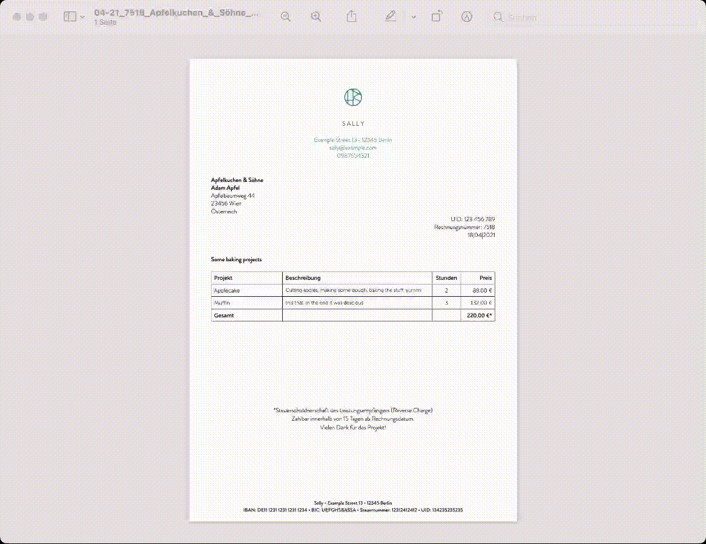

# Cash Machine
This is an app to help you track projects and to automatically create PDF invoices from these projects for you.

## Walkthrough
### App

### Invoice PDF

## Run it
Quick note: Some parts of this application were built the way they were built, because I wanted to better understand how specific parts of an application work. For instance, I did not use any ORM, but built my own query builder etc.

### Install dependencies
1. run `npm i` in the root directory
2. run `npm i` in the /client directory

### Postgres Setup
1. Install postgres
2. change the pg connection string in db/index.js to match your db setup
3. run `node node_modules/connect-pg-simple/table.sql` to set up the table to store cookie sessions
4. run `node bin/seeds.js` to set all other tables that the application needs
5. you have set up the database successfully :)

### How to run
1. start the express server with `npm run dev` in the root directory
2. to start the development server for the react app run `npm start` in the /client directory
